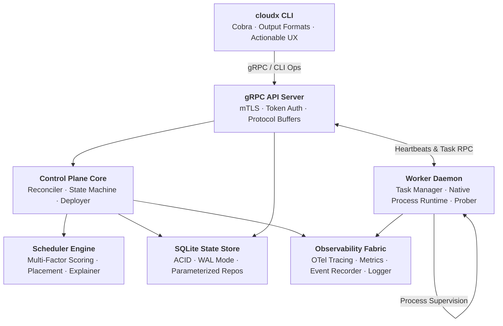

<a id="top"></a>
<div align="center">

```text
   ██████╗██╗      ██████╗ ██╗   ██╗██████╗ ██╗  ██╗
  ██╔════╝██║     ██╔═══██╗██║   ██║██╔══██╗╚██╗██╔╝
  ██║     ██║     ██║   ██║██║   ██║██║  ██║ ╚███╔╝ 
  ██║     ██║     ██║   ██║██║   ██║██║  ██║ ██╔██╗ 
  ╚██████╗███████╗╚██████╔╝╚██████╔╝██████╔╝██╔╝ ██╗
   ╚═════╝╚══════╝ ╚═════╝  ╚═════╝ ╚═════╝ ╚═╝  ╚═╝
```

<h3>Local-First Private Cloud Runtime & Developer Infrastructure Platform</h3>

<p>
  <b>CloudX</b> is a resilient, zero-dependency private cloud engine that allows developers<br/>
  to deploy, schedule, execute, monitor, recover, scale, and orchestrate services and jobs<br/>
  across single machines or multi-node clusters with continuous desired-state reconciliation.
</p>

<sub>
  <b>CloudX Core</b> &nbsp;·&nbsp;
  Desired-State Loop &nbsp;·&nbsp; Pure Go &nbsp;·&nbsp; Native Process Runtime &nbsp;·&nbsp; SQLite WAL &nbsp;·&nbsp; gRPC / mTLS
</sub>

<br/><br/>

```text
  $ cloudx deploy -f web-service.yaml
    ✓ DEPLOYED   service "api" (v1) · 3 replicas scheduled across 3 nodes

  $ cloudx status
    ● CLUSTER HEALTHY · 3/3 Nodes Online · 3/3 Replicas Active · 0 Reconcile Drift
```

<br/>

<!-- Badges -->
<table>
  <tr>
    <td align="center"><a href="https://go.dev/"></a></td>
    <td align="center"><a href="proto/v1/"></a></td>
    <td align="center"><a href="#cross-platform-support"></a></td>
    <td align="center"><a href="LICENSE"></a></td>
  </tr>
  <tr>
    <td align="center"><a href="#state-engine--sqlite-wal"></a></td>
    <td align="center"><a href="#scheduler--placement-engine"></a></td>
    <td align="center"><a href="#security--defensive-hardening"></a></td>
    <td align="center"><a href="#testing--verification"></a></td>
  </tr>
</table>

<br/>

<!-- Navigation -->
<table>
  <tr>
    <th align="center">🚀 &nbsp;Get Started</th>
    <th align="center">🧠 &nbsp;Understand It</th>
    <th align="center">🛡️ &nbsp;Trust It</th>
  </tr>
  <tr>
    <td align="left" valign="top">
      <a href="#quick-start-guide"><b>Quick Start</b></a><br/>
      <a href="#developer-cli-command-matrix">CLI Reference</a><br/>
      <a href="#manifest-specifications">Manifest Specs</a><br/>
      <a href="#what-problem-does-this-solve">Why CloudX?</a>
    </td>
    <td align="left" valign="top">
      <a href="#core-guarantee"><b>Core Guarantee</b></a><br/>
      <a href="#architecture-overview">Architecture</a><br/>
      <a href="#continuous-reconciliation-loop">Reconciliation Loop</a><br/>
      <a href="#scheduler--placement-engine">Scheduler Engine</a>
    </td>
    <td align="left" valign="top">
      <a href="#security--defensive-hardening"><b>Security &amp; Redaction</b></a><br/>
      <a href="#fault-tolerance--self-healing">Self-Healing</a><br/>
      <a href="#testing--verification">Reliability Audits</a><br/>
      <a href="#cross-platform-builds--targets">Cross-Platform</a><br/>
      <a href="#cicd-workflows--release-automation">CI/CD Pipelines</a>
    </td>
  </tr>
</table>

<sub>
  ⌨️ &nbsp;<code>go build -o bin/cloudx ./cmd/cloudx</code> &nbsp;→&nbsp;
  <code>cloudx server &amp; cloudx worker start &amp; cloudx deploy -f service.yaml</code> &nbsp;→&nbsp; done.
</sub>

<!-- How it works -->
<h3>⚙️ How continuous reconciliation works</h3>

<table>
  <tr>
    <td align="center" width="25%" valign="top">
      <h3>①</h3>
      <b>Declare Desired State</b><br/>
      <sub>Submit versioned YAML manifests specifying replicas, commands, resource constraints, and health probes.</sub>
    </td>
    <td align="center" width="25%" valign="top">
      <h3>②</h3>
      <b>Score &amp; Schedule</b><br/>
      <sub>Multi-factor scheduler deterministically scores candidate workers on CPU/RAM headroom and spread anti-affinity.</sub>
    </td>
    <td align="center" width="25%" valign="top">
      <h3>③</h3>
      <b>Supervise &amp; Monitor</b><br/>
      <sub>Worker daemons spawn native OS processes, stream logs to ring buffers, and evaluate continuous health probes.</sub>
    </td>
    <td align="center" width="25%" valign="top">
      <h3>④</h3>
      <b>Self-Heal &amp; Converge</b><br/>
      <sub>Reconciler constantly detects process crashes or lost heartbeats, evicts dead tasks, and restores target capacity.</sub>
    </td>
  </tr>
</table>

<sub>
  <b>Steady State</b> → ① ② ③ (zero reconciliation churn) &nbsp;&nbsp;|&nbsp;&nbsp;
  <b>Crash / Node Lost</b> → ④ (immediate detection &amp; replacement) &nbsp;&nbsp;|&nbsp;&nbsp;
  <b>Rolling Upgrade</b> → canary phased cutover with instant rollback
</sub>

</div>

<br/>

---

<a id="core-guarantee"></a>
## ⚖️ Core Guarantee

<div align="left">

> ### The cluster must always converge to the declared desired state.
> If any process dies, worker disconnects, or node crashes, CloudX automatically detects the anomaly,
> evicts orphaned state, and **restores healthy replica capacity without human intervention**.

</div>

<br/>

### 🤝 The Architectural Contract

<table>
  <tr>
    <th width="33%" align="left">✅ CloudX guarantees</th>
    <th width="33%" align="left">📝 You provide</th>
    <th width="34%" align="left">↩️ Self-healing fallback</th>
  </tr>
  <tr valign="top">
    <td>
      Deterministic placement and zero replica drift.<br/><br/>
      Sub-millisecond native process supervision without container daemon bloat.<br/><br/>
      Transactional state safety under SQLite WAL with zero torn reads.
    </td>
    <td>
      A <b>declarative service or job manifest</b>: command, arguments, environment, and required replicas.<br/><br/>
      <b>Health probe definitions</b>: process checks or HTTP endpoints.
    </td>
    <td>
      Workload crash: auto-restart with exponential backoff.<br/><br/>
      Worker lost: graceful task eviction and rescheduling onto surviving nodes.<br/><br/>
      Canary failure: zero-downtime automated rollback to the last stable revision.
    </td>
  </tr>
</table>

<br/>

### 🧱 The Six Architectural Pillars

<table>
  <tr>
    <th width="26%" align="left">Pillar</th>
    <th width="46%" align="left">What it does</th>
    <th width="28%" align="left">Why it matters</th>
  </tr>
  <tr valign="top">
    <td><b>🔄 Level-Triggered Reconciliation</b></td>
    <td>Continuously compares desired state declarations with reported actual state from all registered worker nodes.</td>
    <td>Network partitions or dropped events never lead to permanent state desynchronization.</td>
  </tr>
  <tr valign="top">
    <td><b>⚡ Native OS Process Runtime</b></td>
    <td>Supervises workloads directly as native OS processes using process groups, job objects, and standard I/O redirection.</td>
    <td>Sub-millisecond cold starts (&lt; 5ms) and tiny memory overhead (&lt; 35MB for the entire control plane).</td>
  </tr>
  <tr valign="top">
    <td><b>🎯 Deterministic Multi-Factor Scheduler</b></td>
    <td>Scores placement decisions across CPU/memory capacity, volume locality, and node spread anti-affinity.</td>
    <td>Provides full decision explainability (<code>cloudx task explain</code>) with zero random assignments.</td>
  </tr>
  <tr valign="top">
    <td><b>💾 Pure-Go SQLite WAL Persistence</b></td>
    <td>Embeds ACID transactional persistence with Write-Ahead Logging and parameterized queries without external database servers.</td>
    <td>Zero CGO dependencies, ultra-fast atomic transactions (~10,600 writes/sec), and 100% crash recovery.</td>
  </tr>
  <tr valign="top">
    <td><b>🛡️ Multi-Layer Defensive Security</b></td>
    <td>Enforces mutual TLS (mTLS), strict execution permission scopes, SafePath traversal guards, and automatic secret redaction.</td>
    <td>Credentials, keys, and tokens are universally scrubbed from logs, events, CLI output, and error traces.</td>
  </tr>
  <tr valign="top">
    <td><b>📡 Built-in Observability &amp; Diagnostics</b></td>
    <td>Provides in-memory metrics histograms, OpenTelemetry-compatible tracing, circular log buffers, and 9-vector health diagnosis.</td>
    <td>Complete cluster telemetry and health inspection out of the box with zero required external collectors.</td>
  </tr>
</table>

<br/>

---

<a id="what-problem-does-this-solve"></a>
## 💡 What Problem Does This Solve?

Modern container orchestrators like Kubernetes impose massive complexity and heavy resource footprints (etcd quorums, multi-component control planes, 500MB+ base RAM), making them overkill and brittle for local development, edge nodes, single machines, and lightweight private clouds. Conversely, basic supervisor scripts lack self-healing, multi-node placement, rolling deployments, and discovery.

<table>
  <tr>
    <th width="50%" align="left">❌ Traditional Orchestration Complexity</th>
    <th width="50%" align="left">✅ With CloudX</th>
  </tr>
  <tr valign="top">
    <td>
      Heavy container daemons and large memory overhead (&gt;500MB).<br/>
      Complex multi-component control plane setup with external databases.<br/>
      Opaque scheduling and slow container cold starts (seconds).<br/>
      Cryptic raw RPC failures without actionable developer guidance.<br/>
      Accidental secret leakage across log streams and stack traces.
    </td>
    <td>
      Ultra-lightweight pure Go runtime (&lt;35MB RAM, &lt;5ms process startup).<br/>
      Single-binary embedded SQLite WAL control plane with zero setup.<br/>
      Explainable multi-factor scoring with instant task assignment.<br/>
      Actionable developer error UX with contextual recovery suggestions.<br/>
      Universal automated secret and credential redaction across all layers.
    </td>
  </tr>
</table>

<br/>

---

<a id="architecture-overview"></a>
## 🏛️ Architecture Overview

CloudX is architected as clean, decoupled subsystems communicating over versioned gRPC protocol buffers with transactional state persistence.



<br/>

### 🧱 Subsystem Directory Structure

```text
cloudx/
├── cmd/
│   ├── cloudx/           # Primary CLI entrypoint (Cobra)
│   └── cloudx-worker/    # Worker node daemon entrypoint
├── internal/
│   ├── api/              # gRPC API server & service implementations
│   ├── auth/             # Token validator, mTLS PKI, permission scopes & secret scrubber
│   ├── common/           # Identifiers (id.ID), versioning & structured logging
│   ├── config/           # YAML configuration engine, env resolution & validator
│   ├── controlplane/     # Central brain, reconciler, deployment manager & volume controller
│   ├── diagnostics/      # 9-vector cluster health & sanity diagnostic engine
│   ├── events/           # Append-only audit trail event engine
│   ├── health/           # Heartbeat failure detector & active task health probers
│   ├── logs/             # Workload ring-buffer logger & log aggregator
│   ├── metrics/          # Counters, Gauges & Histograms in-memory metrics model
│   ├── otel/             # OpenTelemetry-compatible tracing, spans & metric bridge
│   ├── registry/         # Service discovery & port allocation registry
│   ├── runtime/          # Native OS process runtime & execution supervisor
│   ├── scheduler/        # Deterministic scoring, placement & assignment coordinator
│   ├── simulation/       # Chaos fault injectors (kill process, delay heartbeat, break probe)
│   ├── spec/             # Service, Job, and Volume specification schemas
│   ├── state/            # Models, SQLite WAL repositories & state transition validations
│   └── worker/           # Worker daemon orchestration, task manager & hardware monitor
├── proto/v1/             # Protocol Buffer RPC definitions (cloudx.v1)
├── configs/              # Reference configuration templates (cloudx.yaml)
├── scripts/              # Cross-compilation, packaging & release automation
├── test/integration/     # Hermetic integration test harness, race & killer demo suites
└── docs/                 # Architectural specifications, design decisions & phase reports
```

<br/>

---

<a id="quick-start-guide"></a>
## 🚀 Quick Start Guide

Get a full CloudX control plane and worker cluster running in under 2 minutes.

<table>
  <tr>
    <td align="center" width="25%"><h3>①</h3><b>Build</b><br/><sub>compile <code>cloudx</code> binaries</sub></td>
    <td align="center" width="25%"><h3>②</h3><b>Initialize</b><br/><sub>start control plane &amp; worker</sub></td>
    <td align="center" width="25%"><h3>③</h3><b>Deploy</b><br/><sub>run declarative service</sub></td>
    <td align="center" width="25%"><h3>④</h3><b>Observe</b><br/><sub>inspect, scale &amp; diagnose</sub></td>
  </tr>
</table>

<br/>

### 1️⃣ Build Binaries

**Requires:** [Go 1.22+](https://go.dev/dl/) and Git.

```bash
# Clone the repository
git clone https://github.com/Ashish6298/cloudx.git
cd cloudx

# Build CLI and Worker binaries
go build -o bin/cloudx ./cmd/cloudx
go build -o bin/cloudx-worker ./cmd/cloudx-worker
```

<br/>

### 2️⃣ Initialize Cluster & Daemons

In separate terminal windows (or background processes):

**Start the Control Plane:**
```bash
./bin/cloudx server
```

**Start a Worker Daemon:**
```bash
./bin/cloudx worker start
```

**Check cluster health:**
```bash
./bin/cloudx status
```

<br/>

### 3️⃣ Deploy Your First Workload

Create a simple manifest `web-service.yaml`:

```yaml
name: web-api
version: v1
runtime: native
command: python3
args: ["-m", "http.server", "8080"]
replicas: 3
resources:
  cpu_cores: 0.5
  memory_mb: 128
health_checks:
  - type: process
    interval: 2s
    timeout: 500ms
```

**Deploy the service:**
```bash
./bin/cloudx deploy -f web-service.yaml
```

**Verify active tasks and status:**
```bash
./bin/cloudx service list
./bin/cloudx service inspect web-api
```

<br/>

### 4️⃣ Dynamic Scaling, Rollback & Diagnostics

**Scale replicas up or down:**
```bash
./bin/cloudx service scale web-api 5
```

**Stream workload logs:**
```bash
./bin/cloudx service logs web-api
```

**Run cluster-wide diagnostics:**
```bash
./bin/cloudx diagnose
```

**Perform instant version rollback:**
```bash
./bin/cloudx rollback web-api
```

<br/>

---

<a id="developer-cli-command-matrix"></a>
## 💻 Developer CLI Command Matrix

The `cloudx` CLI provides a unified, ergonomic command surface across all orchestration primitives:

```text
  COMMAND             ALIAS        DESCRIPTION
  ─────────────────────────────────────────────────────────────────────────────────────────────
  cloudx init                      Initialize local cluster storage and configuration
  cloudx status                    Display cluster health, node summary, and reconcile drift
  cloudx server                    Start the CloudX Control Plane gRPC daemon
  cloudx cluster      cl           Manage cluster nodes, tokens, and control plane topology
  cloudx worker       wrk          Start, join, drain, and inspect worker node daemons
  cloudx deploy       apply        Deploy declarative service or batch job manifests
  cloudx rollback                  Safely rollback a service to a previous deployment revision
  cloudx service      svc          List, inspect, scale, restart, and view service endpoints
  cloudx job                       Run, list, inspect, and track batch job executions
  cloudx node                      List and gracefully drain cluster compute nodes
  cloudx volume       vol          Provision and inspect persistent storage volumes
  cloudx network      net          Manage logical virtual networks and port mappings
  cloudx task                      Inspect task lifecycle state and explain placement scoring
  cloudx events       ev           Stream structured, append-only cluster audit events
  cloudx diagnose     doctor, diag Run automated 9-vector cluster health and sanity checks
  cloudx metrics                   Inspect in-process system counters, gauges, and histograms
  cloudx otel                      Inspect in-memory OpenTelemetry trace spans and OTLP status
  cloudx version                   Print version, git commit, and target platform metadata
```

<br/>

### Machine-Readable JSON Output (`--output json` / `-o json`)

All commands support `--output json` (or `-o json` / `--json`) for integration into CI/CD pipelines, `jq` scripts, and automation:

```bash
cloudx status -o json
cloudx cluster nodes --output json
cloudx service inspect web-api -o json
cloudx task explain tsk-12345 --output json
cloudx diagnose -o json
```

<br/>

---

<a id="developer-error-ux"></a>
## 💡 Actionable Developer Error UX

CloudX rejects confusing, unhelpful RPC traces in favor of contextual explanations with concrete suggested commands and remediation paths:

```text
CloudX control plane is unreachable.

Endpoint:
127.0.0.1:7000

Possible causes:
- Control plane daemon is stopped.
- Incorrect endpoint address in cloudx.yaml.
- Network connection blocked by firewall.

Suggested actions:
- Start the control plane with: 'cloudx server'
- Verify configuration with: 'cloudx config show'
- Provide an explicit endpoint with: '--control-plane-addr <host:port>'

(For raw technical root-cause details, pass: --verbose / -v)
```

<br/>

---

<a id="security--defensive-hardening"></a>
## 🛡️ Security & Defensive Hardening

CloudX implements strict zero-trust defensive engineering verified across 8 core security vectors:

<table>
  <tr>
    <th width="30%" align="left">Security Domain</th>
    <th width="70%" align="left">Enforcement Mechanism</th>
  </tr>
  <tr valign="top">
    <td><b>🔒 Automatic Secret Redaction</b></td>
    <td>Universal regex scrubbing of database passwords, JWT tokens, AWS credentials, and PEM private keys across logs, events, error traces, and CLI displays.</td>
  </tr>
  <tr valign="top">
    <td><b>🛡️ SafePath Path Confinement</b></td>
    <td>Validates all volume paths and runtime directories against path traversal attacks (<code>../</code>, symlink escapes) to confine operations within storage roots.</td>
  </tr>
  <tr valign="top">
    <td><b>🔑 mTLS &amp; Token Authentication</b></td>
    <td>Cryptographic mutual TLS verification between workers and control planes with bootstrap cluster join tokens.</td>
  </tr>
  <tr valign="top">
    <td><b>🧱 Permission Scope Demarcation</b></td>
    <td>Role-based execution boundaries strictly separating <code>Control-Plane</code>, <code>Worker</code>, and <code>Runtime</code> contexts.</td>
  </tr>
  <tr valign="top">
    <td><b>💉 SQL &amp; Command Injection Safety</b></td>
    <td>100% parameterized SQL queries and alphanumeric identifier validation rejecting shell metacharacters (<code>;</code>, <code>&amp;</code>, <code>|</code>).</td>
  </tr>
</table>

<br/>

---

<a id="performance--scale-benchmarks"></a>
## ⚡ Performance & Scale Benchmarks

CloudX is engineered for high throughput and sub-millisecond execution:

### 1. Scheduler Placement Throughput (Phase 76)

| Scale (Worker Nodes) | Avg Latency | P95 Latency | Placement Throughput | Alloc Memory / Op |
| :--- | :--- | :--- | :--- | :--- |
| **10 Workers** | **3.09 µs** | &lt; 10 µs | **~323,000 placements/sec** | 5.5 KB |
| **50 Workers** | **21.9 µs** | &lt; 50 µs | **~45,500 placements/sec** | 23.8 KB |
| **100 Workers** | **47.6 µs** | ~520 µs | **~21,000 placements/sec** | 48.2 KB |
| **500 Workers** | **371.8 µs** | ~1.28 ms | **~2,700 placements/sec** | 366.7 KB |

<br/>

### 2. Reconciliation Sweep Latency (Phase 77)

| Scale Scenario | Services Evaluated | Tasks Evaluated | Sweep Latency | Steady-State Events |
| :--- | :--- | :--- | :--- | :--- |
| **10 Services / 20 Tasks** | 10 | 20 | **2.66 ms** | 0 (Zero Drift) |
| **100 Services / 200 Tasks** | 100 | 200 | **17.77 ms** | 0 (Zero Drift) |
| **250 Services / 1,000 Tasks** | 250 | 1,000 | **49.90 ms** | 0 (Zero Drift) |

<br/>

---

<a id="cross-platform-builds--targets"></a>
## 💻 Cross-Platform Builds & Target Architectures

CloudX is written in pure Go (`CGO_ENABLED=0`) and natively cross-compiles across all primary developer platforms:

<table>
  <tr>
    <th width="25%" align="left">Operating System</th>
    <th width="20%" align="left">Architecture</th>
    <th width="30%" align="left">CLI Binary</th>
    <th width="25%" align="left">Worker Daemon</th>
  </tr>
  <tr>
    <td><b>Windows</b></td>
    <td><code>amd64</code> (x86_64)</td>
    <td><code>cloudx.exe</code></td>
    <td><code>cloudx-worker.exe</code></td>
  </tr>
  <tr>
    <td><b>Windows</b></td>
    <td><code>arm64</code></td>
    <td><code>cloudx.exe</code></td>
    <td><code>cloudx-worker.exe</code></td>
  </tr>
  <tr>
    <td><b>Linux</b></td>
    <td><code>amd64</code> (x86_64)</td>
    <td><code>cloudx</code></td>
    <td><code>cloudx-worker</code></td>
  </tr>
  <tr>
    <td><b>Linux</b></td>
    <td><code>arm64</code> (aarch64)</td>
    <td><code>cloudx</code></td>
    <td><code>cloudx-worker</code></td>
  </tr>
  <tr>
    <td><b>macOS</b></td>
    <td><code>amd64</code> (Intel)</td>
    <td><code>cloudx</code></td>
    <td><code>cloudx-worker</code></td>
  </tr>
  <tr>
    <td><b>macOS</b></td>
    <td><code>arm64</code> (Apple Silicon)</td>
    <td><code>cloudx</code></td>
    <td><code>cloudx-worker</code></td>
  </tr>
</table>

<br/>

---

<a id="testing--verification"></a>
## 🧪 Testing & Verification

CloudX is validated by an exhaustive suite of unit, integration, stress, and invariant audit tests:

```bash
# 1. Run all unit and subsystem tests
go test ./...

# 2. Run deterministic failure scenario suite (10 failure modes)
go test -v -run TestFailure_ ./test/integration/...

# 3. Run high-concurrency race condition hardening tests
go test -v -run TestRace_ ./test/integration/...

# 4. Run Golden-Path 17-step End-to-End cluster lifecycle suite
go test -v -run TestE2E_GoldenPathScenario ./test/integration/...

# 5. Run Reliability Invariants Audit suite
go test -v -run TestReliabilityAudit_Invariants ./test/integration/...

# 6. Run Master 3-Node End-to-End Killer Demo
go test -v -run TestPhase87_KillerDemo ./test/integration/...
```

<br/>

---

<a id="cicd-workflows--release-automation"></a>
## 🔄 CI/CD Workflows & Release Automation

CloudX includes complete, production-grade GitHub Actions CI/CD pipelines ensuring strict code quality, multi-platform test coverage, scale benchmark validation, cross-compilation, and automated release packaging:

### 1. Continuous Integration (`.github/workflows/ci.yml`)

<table>
  <tr>
    <th width="30%" align="left">Pipeline Job</th>
    <th width="70%" align="left">Validation Details</th>
  </tr>
  <tr valign="top">
    <td><b>🧹 Lint &amp; Static Analysis</b></td>
    <td>Enforces strict <code>gofmt</code> formatting compliance, <code>go vet</code> static analysis, and <code>go mod tidy</code> module dependency validation.</td>
  </tr>
  <tr valign="top">
    <td><b>💻 Multi-OS Test Matrix</b></td>
    <td>Runs unit, integration, and reliability invariant suites across <b>Linux (<code>ubuntu-latest</code>)</b>, <b>macOS (<code>macos-latest</code>)</b>, and <b>Windows (<code>windows-latest</code>)</b>.</td>
  </tr>
  <tr valign="top">
    <td><b>⚡ Scale &amp; Capacity Benchmarks</b></td>
    <td>Automates scheduler placement throughput and reconciliation sweep scale tracking.</td>
  </tr>
  <tr valign="top">
    <td><b>📦 Cross-Platform Build Matrix</b></td>
    <td>Validates cross-compilation across all 6 target binaries (<code>windows/amd64</code>, <code>windows/arm64</code>, <code>linux/amd64</code>, <code>linux/arm64</code>, <code>darwin/amd64</code>, <code>darwin/arm64</code>).</td>
  </tr>
</table>

<br/>

### 2. Continuous Delivery & Release Packaging (`.github/workflows/cd.yml`)

- **Automated Artifact Generation**: Triggered on semantic version tags (`v*.*.*`) or manual workflow dispatch.
- **Archive Bundling**: Packages `.tar.gz` and `.zip` distribution bundles with embedded version metadata, `README.md`, `LICENSE`, and `INSTALL.md`.
- **Integrity Manifests**: Generates cryptographic `SHA256SUMS` checksum manifests for secure distribution.
- **GitHub Releases**: Automatically publishes releases with changelogs and multi-platform binary assets.

```bash
# Local workflow commands:
make lint              # Check formatting and run static analysis
make test              # Execute unit and subsystem tests
make test-integration  # Execute integration, race and killer demo suites
make bench             # Run scale and performance benchmarks
make cross-build       # Build all 6 cross-platform targets
make release           # Build, package, and generate release checksums
```

<br/>

---

## 📄 License

CloudX is open-source software licensed under the **[MIT License](./LICENSE)**.
