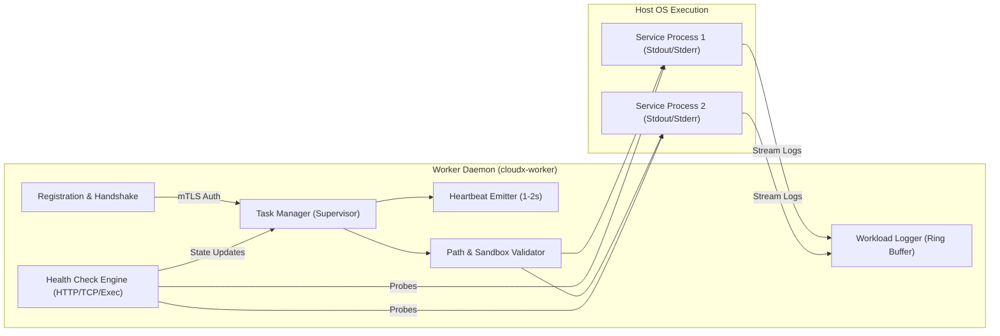
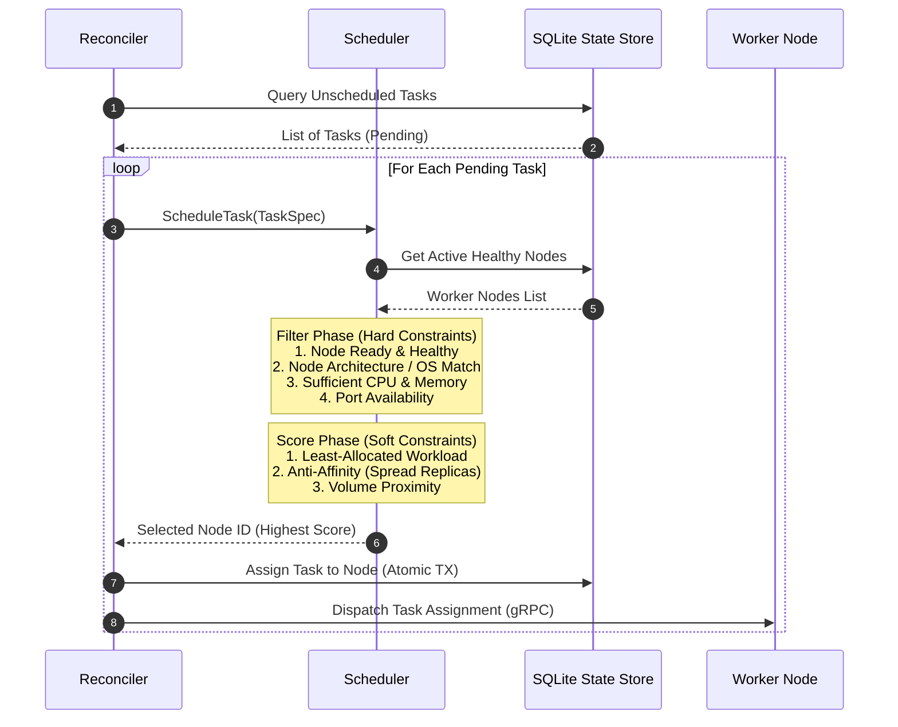
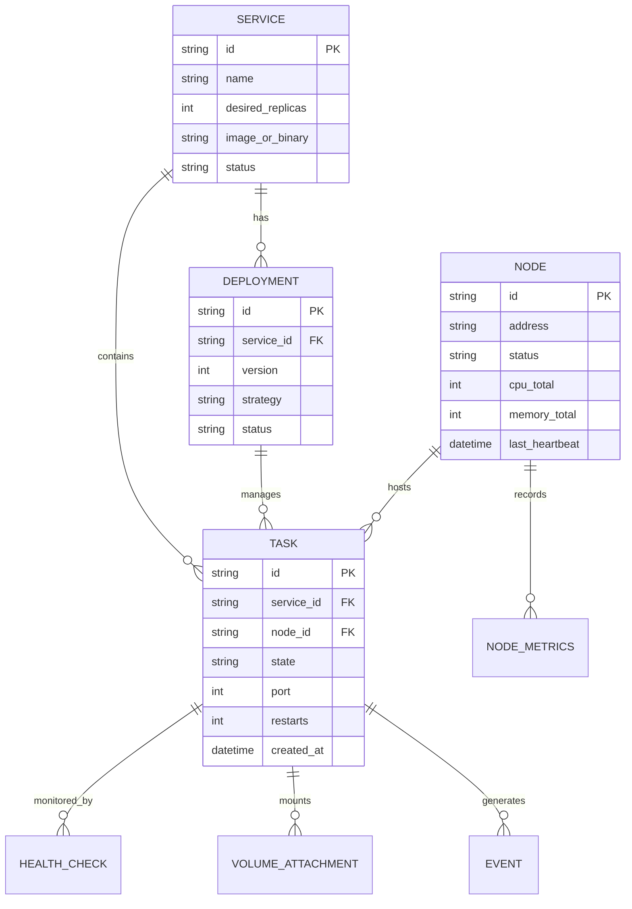
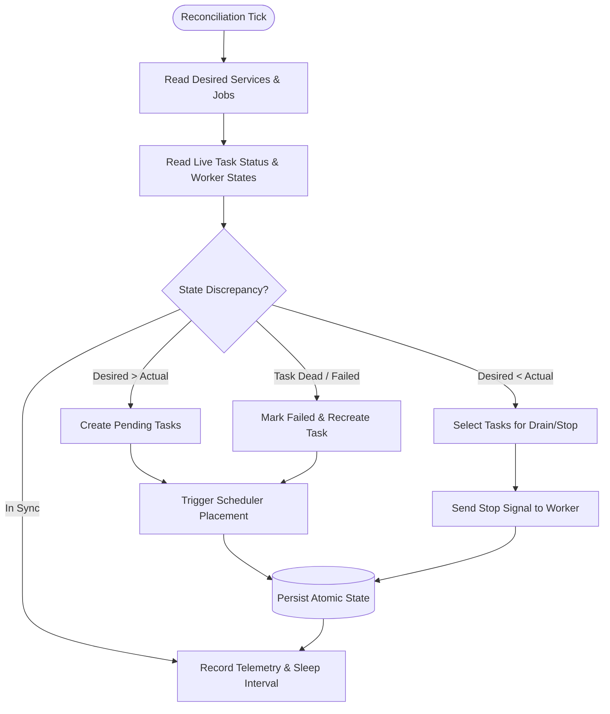
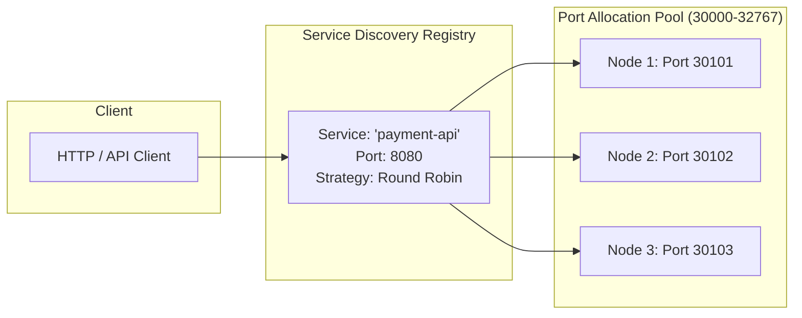
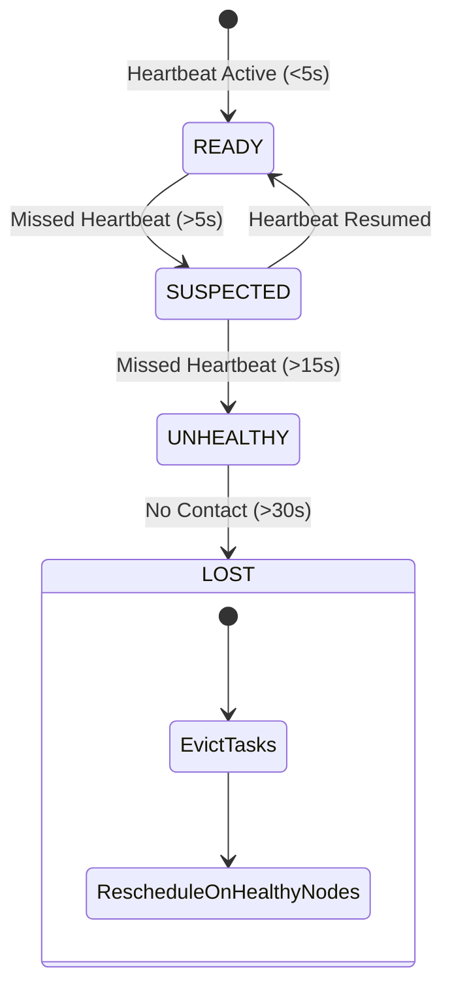

# CloudX Architecture Guide

Welcome to the CloudX architectural blueprint. This document provides a comprehensive, component-level breakdown of the CloudX distributed system, designed to give engineers complete technical clarity on the control plane, worker nodes, native process runtime, scheduling algorithms, state persistence, reconciliation loops, networking model, and fault recovery mechanics without needing to reverse-engineer the codebase.

---

## Table of Contents
1. [System Overview & Philosophy](#1-system-overview--philosophy)
2. [High-Level Architecture & Topology](#2-high-level-architecture--topology)
3. [Control Plane Architecture](#3-control-plane-architecture)
4. [Worker Node Architecture](#4-worker-node-architecture)
5. [Runtime Model (Native OS Workloads)](#5-runtime-model-native-os-workloads)
6. [Scheduler & Placement Engine](#6-scheduler--placement-engine)
7. [State Model & Storage (SQLite WAL)](#7-state-model--storage-sqlite-wal)
8. [Desired-State Reconciliation Loop](#8-desired-state-reconciliation-loop)
9. [Networking & Port Allocation Model](#9-networking--port-allocation-model)
10. [Failure Detection, Self-Healing & Recovery](#10-failure-detection-self-healing--recovery)
11. [Security, Auth & Boundary Isolation](#11-security-auth--boundary-isolation)
12. [Observability, Diagnostics & Metrics](#12-observability-diagnostics--metrics)

---

## 1. System Overview & Philosophy

**CloudX** is a local-first, zero-cloud-dependency private cloud orchestrator. It manages services, batch jobs, volumes, networks, and persistent workloads across single or multi-node topologies.

### Core Architectural Tenets
- **Local-First & Autonomous**: Operates entirely on developer workstations, bare-metal servers, or private VMs without external cloud IAM, managed databases, or SaaS dependencies.
- **Pure Go & Zero CGO**: Built natively with pure-Go SQLite (`modernc.org/sqlite`) and Go 1.22+ standard primitives for 100% portable binaries across Windows, Linux, and macOS.
- **Single Master Control Plane**: Uses a unified control plane orchestrating workers over gRPC/mTLS with strict deterministic scheduling and transactional SQLite state.
- **Declarative Desired-State Loop**: Continuous convergence engine (`Desired State` vs. `Actual State`) ensuring self-healing, automatic rollback, and resilient task recovery.

---

## 2. High-Level Architecture & Topology

```mermaid
flowchart TB
    subgraph ClientLayer["Client & Developer Interface"]
        CLI["CloudX CLI (cloudx)"]
        APISDK["SDK / REST / gRPC Clients"]
    end

    subgraph ControlPlane["CloudX Control Plane"]
        API["gRPC & HTTP API Gateway"]
        AUTH["Auth & TLS Verification"]
        RECON["Reconciler Loop"]
        SCHED["Deterministic Scheduler"]
        VOLM["Volume Manager"]
        JOBM["Job Engine"]
        DEPLOYM["Deployment Controller (Rollouts/Rollbacks)"]
        SQLITE[("SQLite WAL State Store")]
        EVREC["Event Recorder & Audit"]
        METRICS["Metrics & OTEL Engine"]
    end

    subgraph Worker1["Worker Node 1"]
        WD1["Worker Daemon"]
        TM1["Task Manager"]
        HC1["Health Check Probes"]
        RT1["Native Runtime Engine"]
        WL1["Task 1 (PID 1024)"]
        WL2["Task 2 (PID 1025)"]
    end

    subgraph Worker2["Worker Node 2"]
        WD2["Worker Daemon"]
        TM2["Task Manager"]
        HC2["Health Check Probes"]
        RT2["Native Runtime Engine"]
        WL3["Task 3 (PID 2048)"]
    end

    subgraph Worker3["Worker Node 3 (Spare / Scaled)"]
        WD3["Worker Daemon"]
        TM3["Task Manager"]
        HC3["Health Check Probes"]
        RT3["Native Runtime Engine"]
    end

    CLI -->|gRPC / TLS| API
    APISDK -->|gRPC / TLS| API
    API --> AUTH
    AUTH --> RECON
    RECON <--> SQLITE
    SCHED <--> SQLITE
    DEPLOYM <--> RECON
    VOLM <--> SQLITE
    JOBM <--> SQLITE
    RECON --> EVREC
    API --> METRICS

    RECON -->|mTLS gRPC Assign/Drain| WD1
    RECON -->|mTLS gRPC Assign/Drain| WD2
    RECON -->|mTLS gRPC Assign/Drain| WD3

    WD1 -->|Heartbeat / Actual State| API
    WD2 -->|Heartbeat / Actual State| API
    WD3 -->|Heartbeat / Actual State| API

    TM1 --> RT1 --> WL1 & WL2
    TM2 --> RT2 --> WL3
    HC1 -.-> WL1 & WL2
    HC2 -.-> WL3
```

---

## 3. Control Plane Architecture

The Control Plane is the single source of truth and brain of the CloudX cluster. It exposes API endpoints, persists cluster specifications, scores and assigns tasks to workers, and enforces reconciliation.

### Key Subsystems:
1. **API Server (`internal/api/`)**:
   - Handles client commands (deploy, scale, rollback, logs, events, metrics, diagnose).
   - Manages worker registration, heartbeat reception, and streaming status reports.
2. **Reconciler (`internal/controlplane/reconciler.go`)**:
   - Periodically executes state convergence ticks.
   - Computes diffs between `Desired Replicas` and `Healthy Running Tasks`.
   - Serialized via `reconcileMu` mutex to prevent race conditions during high-frequency API mutations.
3. **Deployment Manager (`internal/controlplane/deploy.go`)**:
   - Manages rolling updates (canary, blue-green, percentage-based rollouts).
   - Monitors deployment health thresholds and automatically initiates rollbacks on sustained probe failures.
4. **Volume Manager (`internal/controlplane/volume_manager.go`)**:
   - Manages persistent volumes and mount paths with path-traversal sandboxing.
5. **Job Controller (`internal/controlplane/job_execution.go`)**:
   - Tracks batch execution, retry counts, exit codes, and cleanup policies.

---

## 4. Worker Node Architecture

A Worker Node is a daemon process (`cloudx-worker`) running on each physical or virtual machine. It connects to the control plane, advertises available capacity, receives task assignments, and supervises process lifecycles.

### Worker Lifecycle:
1. **Bootstrap & TLS**: Reads local certificate or requests identity authorization.
2. **Registration**: Sends CPU cores, memory limits, disk space, and label metadata to the control plane.
3. **Heartbeat Loop**: Sends regular heartbeats with active task IDs, resource usage, and health states.
4. **Task Execution**: Launches OS processes with sandboxed environment variables, injected volume paths, and allocated port bindings.
5. **Auto-Restart & Supervision**: Detects process crashes, evaluates restart policies (Never, On-Failure, Always), applies exponential backoff, and reports status transitions.

---

## 5. Runtime Model (Native OS Workloads)

CloudX implements a native process runtime (`internal/runtime/native.go`) that executes binaries directly on the host operating system with strict resource control, environment isolation, and lifecycle signaling.

### Native Runtime Features:
- **Clean Signal Propagation**: Graceful shutdown using `SIGTERM` / `SIGINT` with configurable termination grace periods (default 10s) before issuing `SIGKILL` / `TerminateProcess`.
- **Secret Scrubbing**: Automatic redaction of sensitive credentials (tokens, API keys, passwords) from process arguments and environment descriptors.
- **Log Streaming**: Non-blocking capture of stdout/stderr pipes into an in-memory ring buffer with tail query support (`cloudx logs`).
- **Path Isolation**: Directory sandboxing preventing access outside configured task workspaces.

---

## 6. Scheduler & Placement Engine

The Scheduler (`internal/scheduler/`) evaluates unassigned tasks and deterministically assigns them to optimal worker nodes.

---

## 7. State Model & Storage (SQLite WAL)

CloudX maintains a transactional SQLite database in Write-Ahead Logging (`WAL`) mode located at `~/.cloudx/cloudx.db` (or custom path).

### Storage Characteristics:
- **Zero CGO**: Pure Go engine ensures no external runtime dependencies or compilation toolchain conflicts.
- **ACID Transactions**: Multi-statement state updates (e.g. node drain + task reassignment) run within serialized database transactions.
- **WAL Concurrency**: Supports high-throughput concurrent readers with non-blocking transactional writes.

---

## 8. Desired-State Reconciliation Loop

The Reconciler (`internal/controlplane/reconciler.go`) acts as the continuous feedback loop ensuring the cluster state matches the declarative specifications.

---

## 9. Networking & Port Allocation Model

CloudX manages local port reservations, endpoint registries, and task-to-task routing.

- **Dynamic Port Allocation**: Assigns non-conflicting host ports from the node's configurable port pool (`30000–32767` by default).
- **Service Discovery**: The built-in registry maps service names to live, healthy endpoints, automatically purging endpoints when tasks fail health checks.
- **Port Conflict Protection**: Prevents scheduling two tasks requesting the same static host port on the same physical worker.

---

## 10. Failure Detection, Self-Healing & Recovery

CloudX implements a multi-stage failure detector (`internal/health/` and `internal/controlplane/`):

### Deterministic Recovery Scenarios:
1. **Workload Process Crash**: Worker task manager intercepts abnormal process termination $\rightarrow$ applies restart policy $\rightarrow$ restarts process locally with exponential backoff.
2. **Worker Node Crash / Network Partition**: Control plane detects missed heartbeats $\rightarrow$ node transitions to `LOST` $\rightarrow$ reconciler evacuates all assigned tasks and schedules replacements on surviving workers.
3. **Control Plane Restart**: Control plane boots $\rightarrow$ recovers SQLite state $\rightarrow$ workers reconnect during heartbeat sweep $\rightarrow$ reconciler validates running vs. desired state with zero workload downtime.
4. **Failed Deployments**: Health probes fail during rolling upgrade $\rightarrow$ threshold exceeded $\rightarrow$ deployment controller aborts rollout and automatically rolls back to previous known-good version.

---

## 11. Security, Auth & Boundary Isolation

- **mTLS & PKI (`internal/auth/tls.go`)**: Mutual TLS authentication between CLI, Control Plane, and Worker Daemons with custom CA verification.
- **Secret Redaction (`internal/auth/secret.go`)**: Redacts passwords, bearer tokens, AWS/GCP keys, and private certificates across logs, events, error traces, and CLI tables.
- **Permission Boundaries (`internal/auth/boundary.go`)**: Role-based access control enforcing strict boundaries between `Control-Plane`, `Worker`, and `Runtime` execution contexts.
- **Path Traversal Protection**: Sanitizes all volume mounts, preventing directory escapes (`../../etc/passwd`).

---

## 12. Observability, Diagnostics & Metrics

- **Prometheus Metrics (`internal/metrics/`)**: High-performance in-memory counters, gauges, and histograms exposed via `/metrics` or `cloudx metrics`.
- **OpenTelemetry Tracing (`internal/otel/`)**: Trace context propagation across RPC calls, reconciler loops, and scheduling decisions with OTLP exporters.
- **Automated Diagnostics (`internal/diagnostics/`)**: Built-in `cloudx diagnose` engine running multi-point verification across network reachability, SQLite integrity, worker health, resource pressure, and orphaned workloads.

---

*CloudX Architecture Documentation — Milestone 20 / Phase 72.*
