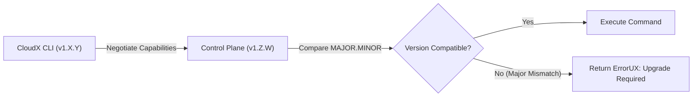
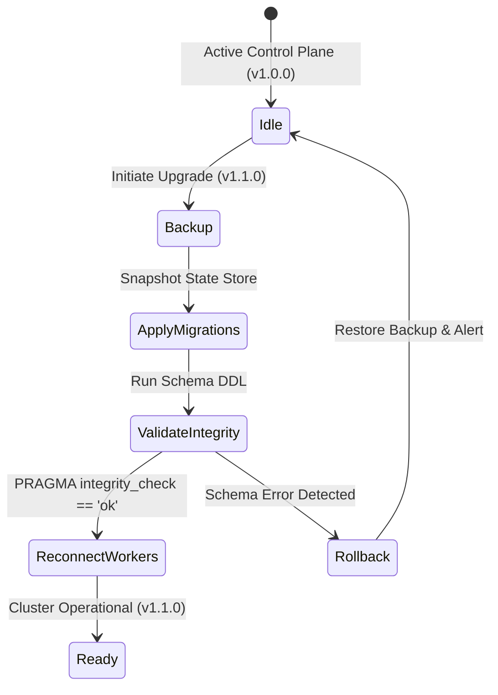

# CloudX Versioning & Compatibility Strategy

Welcome to the CloudX Versioning and Compatibility specification. This document formalizes the compatibility boundaries, version schemes, upgrade safety invariants, and forward/backward interoperability guarantees for the CloudX platform across CLI tools, gRPC protocols, SQLite database schemas, and YAML configuration manifests.

---

## Table of Contents
1. [Core Compatibility Philosophy](#1-core-compatibility-philosophy)
2. [CLI Versioning & Command Compatibility](#2-cli-versioning--command-compatibility)
3. [Protocol & RPC Versioning (gRPC / Protobuf)](#3-protocol--rpc-versioning-grpc--protobuf)
4. [State Schema Versioning (SQLite Migrations)](#4-state-schema-versioning-sqlite-migrations)
5. [Configuration & Manifest Versioning](#5-configuration--manifest-versioning)
6. [Safe Upgrade & Downgrade Invariants](#6-safe-upgrade--downgrade-invariants)
7. [Compatibility Support Matrix](#7-compatibility-support-matrix)

---

## 1. Core Compatibility Philosophy

CloudX adheres to **Semantic Versioning 2.0.0 (`MAJOR.MINOR.PATCH`)**:
- **MAJOR**: Incompatible API breaks, wire protocol changes without backward compatibility, or breaking state schema changes.
- **MINOR**: Backward-compatible new features, added CLI commands, extended YAML fields, and schema additions.
- **PATCH**: Backward-compatible bug fixes, security patches, performance hardening, and internal optimizations.

### Key Invariants
- **Zero Silent Corruption**: Upgrading a CloudX binary must never silently corrupt or drop existing cluster state.
- **Graceful Version Rejection**: If an incompatible CLI or worker connects to a mismatched control plane, the connection is rejected immediately with a descriptive error and recommended remediation.
- **$N-1$ Interoperability**: Minor versions of Worker Daemons ($v1.X.y$) are guaranteed to work seamlessly with Control Plane version $v1.(X+1).y$.

---

## 2. CLI Versioning & Command Compatibility

The CloudX CLI (`cloudx`) follows strict flag and output compatibility guarantees:



### Compatibility Rules:
1. **Flag Invariance**: Deprecated CLI flags remain functional for at least one minor release cycle with non-blocking warning notices.
2. **JSON & YAML Structured Output Contract**: Automated tooling relying on `--output json` or `--output yaml` is guaranteed stable field names; existing fields will not be renamed or removed within a major version.
3. **Machine-Readable Errors**: Structured error fields (`title`, `endpoint`, `possible_causes`, `remediations`) remain schema-stable.

---

## 3. Protocol & RPC Versioning (gRPC / Protobuf)

CloudX RPC interfaces use versioned package namespaces:

```protobuf
syntax = "proto3";

package cloudx.v1;
option go_package = "github.com/cloudx-org/cloudx/proto/v1;v1";
```

### Wire Protocol Compatibility Rules:
1. **Field Number Immutability**: Protobuf tag numbers (e.g. `string task_id = 1;`) are immutable once published.
2. **Additive Evolution**: New capabilities, metadata, or metrics must use new, optional field numbers.
3. **Graceful Unknown Field Handling**: Older workers receiving newer protobuf messages discard unrecognized tags without panicking.
4. **Major Protocol Bumps**: Breaking protocol changes must introduce a new package path (e.g. `cloudx.v2`) and run concurrently with `v1` until deprecation.

---

## 4. State Schema Versioning (SQLite Migrations)

CloudX manages database evolution through atomic, linear schema migrations tracked via `schema_migrations`:

```sql
CREATE TABLE IF NOT EXISTS schema_migrations (
    version INTEGER PRIMARY KEY,
    applied_at TIMESTAMP NOT NULL
);
```

### Migration Safety Rules:
1. **Additive Schema Migrations**: New state attributes use `ALTER TABLE ... ADD COLUMN` with safe default values (`DEFAULT ''`, `DEFAULT 0`, or `DEFAULT '{}'`).
2. **Strict Transactional Migrations**: Every migration step runs within an ACID transaction; if any statement fails, the database rolls back to the previous migration version cleanly.
3. **Idempotency**: Calling `Migrate(ctx, db)` on an already up-to-date database is a no-op that validates `PRAGMA integrity_check`.
4. **Automated Backup Before Major Migrations**: Control plane automatically creates a timestamped WAL snapshot (`cloudx.db.backup.<version>`) before applying schema migrations.

---

## 5. Configuration & Manifest Versioning

Service manifests and cluster configuration files declare schema versions explicitly:

```yaml
apiVersion: cloudx/v1
kind: Service
metadata:
  name: payment-api
spec:
  replicas: 3
```

### YAML Compatibility Guarantees:
- **Default Tolerance**: Omitted fields automatically assume built-in defaults without failing validation.
- **Strict Unknown Field Detection**: When running `cloudx config validate`, typos and unrecognized keys are surfaced as warnings while maintaining runtime tolerance.
- **API Version Deprecation**: `apiVersion: cloudx/v1` will remain supported throughout the entirety of CloudX v1.x.

---

## 6. Safe Upgrade & Downgrade Invariants



### Upgrade Protocol:
1. **Control Plane First**: Always upgrade the Control Plane binary before upgrading Worker Daemons.
2. **Workers Next (Rolling)**: Upgrade worker nodes one-by-one; the reconciler maintains desired replicas across remaining active nodes.
3. **Downgrade Safety**: If a rollback is required, restoring the automatic pre-migration snapshot returns the cluster to the exact pre-upgrade state.

---

## 7. Compatibility Support Matrix

| Component | Upstream Target | Compatibility Window | Policy |
| :--- | :--- | :--- | :--- |
| **CLI (`cloudx`)** | Control Plane | $v1.X.y \leftrightarrow v1.Z.w$ | Supported across all v1 minor versions |
| **Worker (`cloudx-worker`)** | Control Plane | $v1.X \leftrightarrow v1.(X \pm 1)$ | $N-1$ and $N+1$ interoperability supported |
| **Service Manifests** | Control Plane | `apiVersion: cloudx/v1` | Full v1 lifecycle forward/backward compatibility |
| **SQLite Schema** | State Engine | Migrations `v1` $\rightarrow$ `vN` | Linear, additive, non-destructive migrations |

---

*CloudX Versioning & Compatibility Specification — Milestone 22 / Phase 82.*
