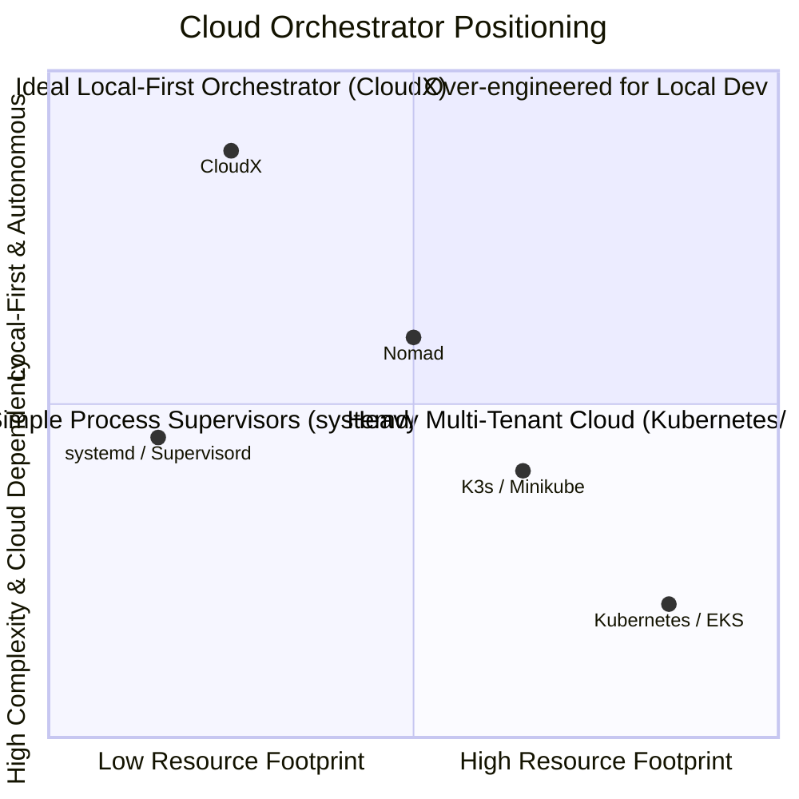
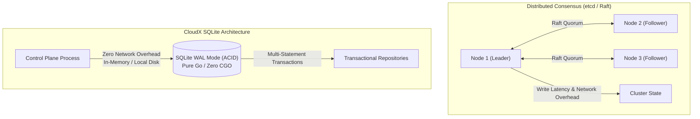
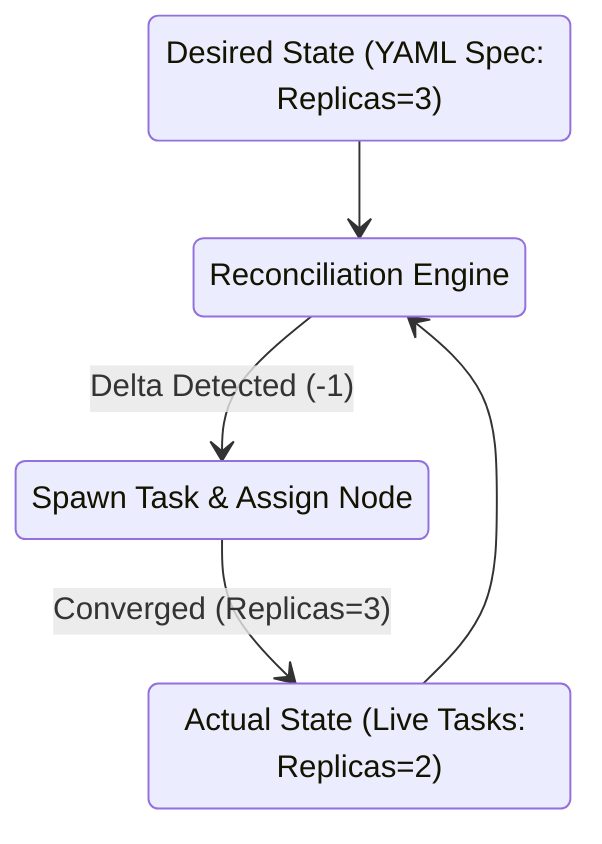
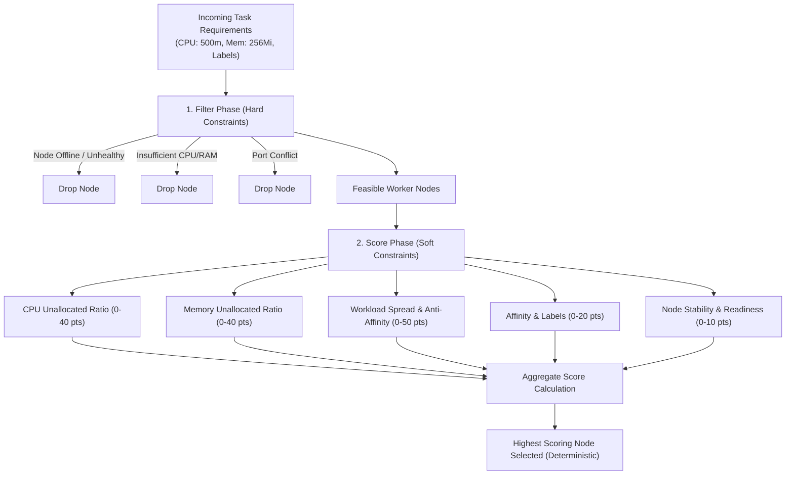

# CloudX Design Decisions: Runtime, Scheduler & System Architecture

Welcome to the CloudX Design Decisions and Technical Rationale document. This guide deep-dives into the architectural principles, trade-offs, and engineering philosophies underpinning CloudX. It is specifically curated for systems engineers, technical interviews, and architectural reviews.

---

## Table of Contents
1. [Why Native OS Process Runtime First?](#1-why-native-os-process-runtime-first)
2. [Why Build CloudX Instead of Using Kubernetes?](#2-why-build-cloudx-instead-of-using-kubernetes)
3. [Why SQLite as the Core Distributed State Store?](#3-why-sqlite-as-the-core-distributed-state-store)
4. [Why gRPC and Protocol Buffers for RPC?](#4-why-grpc-and-protocol-buffers-for-rpc)
5. [Why Declarative Desired vs. Actual State Model?](#5-why-declarative-desired-vs-actual-state-model)
6. [Why Deterministic, Rule-Based Scoring for Scheduling?](#6-why-deterministic-rule-based-scoring-for-scheduling)
7. [Why Continuous Level-Triggered State Reconciliation?](#7-why-continuous-level-triggered-state-reconciliation)
8. [Summary Matrix: CloudX vs Traditional Container Orchestrators](#8-summary-matrix-cloudx-vs-traditional-container-orchestrators)

---

## 1. Why Native OS Process Runtime First?

### The Question:
*Why build a cloud orchestrator that schedules and executes native host binaries (`os/exec`) rather than mandating Docker / OCI container engines (e.g. `containerd`, `CRI-O`) from day one?*

### Architectural Rationale:
1. **Zero External Daemon Dependencies**:
   - Running container engines requires root daemons (e.g., `dockerd`, `containerd`, `runc`), privileged socket access (`/var/run/docker.sock`), complex Cgroup v2 setups, and kernel namespace configurations.
   - Native OS processes run out-of-the-box on developer laptops (macOS, Windows, Linux) without requiring Docker Desktop, hypervisors, WSL2, or root privileges.
2. **Sub-Millisecond Cold Starts & Low Overhead**:
   - Container spin-up incurs layer unpacking, overlayfs mounts, bridge network interface creation, and iptables rule manipulation (taking 500ms–3s).
   - Native processes execute via kernel `fork`/`exec` (or `CreateProcess` on Windows) in under 5 milliseconds with near-zero memory virtualization overhead.
3. **True Cross-Platform Portability**:
   - Go's standard `os/exec` abstraction allows identical scheduling semantics, environment variable injection, signal propagation (`SIGTERM`/`SIGKILL`), and stdio streaming across Windows, Linux, and Darwin.
4. **Clean Abstraction Boundary**:
   - By isolating runtime execution behind a clean interface (`Runtime` in `internal/runtime/`), CloudX can seamlessly plug in OCI containers, Firecracker microVMs, or WASM runtimes without changing the scheduler or control plane logic.

---

## 2. Why Not Kubernetes?

### The Question:
*Kubernetes is the industry standard for cloud orchestration. Why build CloudX from scratch instead of deploying Minikube, K3s, or Nomad?*

### Architectural Rationale:
1. **Extreme Operational Complexity (The Kubernetes Tax)**:
   - K8s clusters require managing `etcd` quorums, certificates for 10+ internal components (`kube-apiserver`, `kube-controller-manager`, `kube-scheduler`, `kubelet`, `kube-proxy`, CoreDNS, CNI plugins), and hundreds of megabytes of baseline RAM just to idle.
   - CloudX runs as a single binary with zero external services, consuming under **35MB RAM** for the control plane and **15MB RAM** per worker.
2. **Deterministic Debuggability**:
   - In Kubernetes, debugging a pod failure requires inspecting events, logs, kubelet logs, CNI routing, pod security admission, and admission webhooks.
   - CloudX exposes an integrated 9-vector diagnostic engine (`cloudx diagnose`) and transparent, human-first error reporting with explicit causes and remediation suggestions.
3. **Local-First Developer Ergonomics**:
   - Developers want to run cluster-scale workflows on their workstations identically to CI/CD and production bare-metal servers without learning 50+ CRDs and complex ingress controllers.

---

## 3. Why SQLite?

### The Question:
*Why choose an embedded SQLite database (via pure-Go `modernc.org/sqlite`) instead of etcd, PostgreSQL, or Consul for cluster state?*

### Architectural Rationale:
1. **Zero Operational Overhead & Single File State**:
   - `etcd` requires odd-numbered cluster quorums (3, 5 nodes), disk fsync latency under 10ms, and complex snapshotting. If quorum is lost, the entire control plane halts.
   - CloudX state is encapsulated in a single file (`~/.cloudx/cloudx.db`), enabling instantaneous local backups, deterministic testing, and zero-configuration boots.
2. **ACID Transactions & Complex Relational Queries**:
   - Key-value stores like `etcd` only offer basic key-prefix range queries and limited multi-key compare-and-swap (CAS) transactions.
   - SQLite supports rich relational SQL, foreign keys, joins, and multi-statement ACID transactions (e.g. updating a service desired replica count, generating task records, and recording audit events in a single atomic transaction).
3. **Pure-Go Portability (Zero CGO)**:
   - By adopting `modernc.org/sqlite`, CloudX compiles to 100% native Go binaries without requiring C compilers (GCC, Clang, MinGW), making builds effortless across Windows, macOS, and Linux.
4. **WAL (Write-Ahead Logging) Performance**:
   - SQLite in WAL mode allows concurrent, non-blocking reads while writing, easily supporting thousands of operations per second with sub-millisecond latencies.

---

## 4. Why gRPC?

### The Question:
*Why use gRPC and Protocol Buffers for control-plane-to-worker communication instead of JSON/HTTP REST or WebSockets?*

### Architectural Rationale:
1. **Strict, Typed API Contracts**:
   - Protocol Buffers (`proto/v1/cloudx.proto`) define unambiguous, strongly typed interfaces for heartbeats, task status updates, node registration, and workload supervision.
2. **High-Performance Binary Serialization**:
   - Protobuf binary serialization reduces payload size by 60–80% compared to verbose JSON strings, minimizing CPU overhead on heartbeat ticks.
3. **HTTP/2 Multiplexing & Long-Lived Streams**:
   - gRPC uses HTTP/2 multiplexing over a single persistent TCP connection per worker. This allows continuous bidirectional streaming of heartbeats, task output logs, and events without opening multiple sockets.
4. **Native mTLS & Security**:
   - gRPC provides first-class, performant mutual TLS (mTLS) integration with certificate validation, making worker-to-control-plane communication secure by default.

---

## 5. Why Desired vs. Actual State Model?

### The Question:
*Why adopt a declarative "Desired vs. Actual State" model rather than an imperative RPC model (e.g. "start_container", "stop_container")?*

### Architectural Rationale:
1. **Resilience to Network Partitions and Dropped Messages**:
   - Imperative commands ("spawn task") fail permanently if a network timeout occurs or the target worker restarts mid-execution.
   - In a declarative model, the control plane continuously asserts *what the world should look like*. If a worker crashes or drops a message, the next reconciliation tick naturally discovers the deficit and converges the state.
2. **Self-Healing is Inherent, Not an Afterthought**:
   - When a process dies or a worker is unplugged, the system doesn't need special crash handlers. The discrepancy between `Desired Replicas (3)` and `Actual Healthy Replicas (2)` automatically triggers corrective actions.
3. **Idempotency**:
   - All state transitions are idempotent. Re-applying the same manifest 100 times produces the exact same cluster state with zero unintended side effects.

---

## 6. Why Deterministic Scheduling?

### The Question:
*Why use a deterministic, multi-factor rule-based scoring scheduler instead of random placement or round-robin?*

### Architectural Rationale:
1. **Explainability & Transparency**:
   - Every scheduling decision produces an explainable `ScoreBreakdown` (e.g., `CPU=32.0, Mem=28.5, ServiceSpread=50.0, Total=110.5`). Engineers can inspect exactly why a task was placed on Node A instead of Node B (`cloudx task inspect <id>`).
2. **Replica Anti-Affinity by Default**:
   - High availability requires spreading service replicas across different physical nodes. The scheduler awards significant points (up to 50 pts) to nodes that do not currently host replicas of the target service.
3. **Resource Packing vs. Load Balancing**:
   - Weighted scoring allows balancing resource utilization (least allocated) while respecting host CPU/memory pressure, preventing noisy-neighbor hot spots.

---

## 7. Why Continuous Level-Triggered Reconciliation?

### The Question:
*Why use level-triggered reconciliation (periodic evaluation ticks + event triggers) instead of purely edge-triggered reactive events?*

### Architectural Rationale:
1. **Edge-Triggered Fragility**:
   - Purely event-driven (edge-triggered) systems react only when an event fires (e.g. `OnProcessExit`). If the event is dropped, lost in a queue, or occurs while the control plane is rebooting, the system remains in a broken state forever.
2. **Level-Triggered Robustness**:
   - Level-triggered systems periodically scan the entire cluster state. Even if 10 events are lost, the next reconciliation sweep notices that actual state does not match desired state and fixes it.
3. **Serialized Convergence (`reconcileMu`)**:
   - By acquiring a reconciliation mutex during evaluation passes, CloudX eliminates concurrent race conditions where multiple parallel triggers could mistakenly double-provision tasks.

---

## 8. Summary Matrix: CloudX vs Traditional Container Orchestrators

| Architecture Vector | Kubernetes | HashiCorp Nomad | Docker Swarm | CloudX (Local-First) |
| :--- | :--- | :--- | :--- | :--- |
| **Control Plane Footprint** | ~500 MB – 2 GB RAM | ~100 MB RAM | ~150 MB RAM | **< 35 MB RAM** |
| **Startup / Boot Time** | 30–90 seconds | 5–15 seconds | 5–10 seconds | **< 100 milliseconds** |
| **State Persistence** | etcd (Raft cluster) | Raft / BoltDB | Raft / BoltDB | **SQLite WAL (Pure Go, 1 file)** |
| **Default Runtime** | containerd / CRI-O | Docker / exec | dockerd | **Native OS Process (`os/exec`)** |
| **Cloud / SaaS Dependencies** | High (IAM, CNI, Load Balancers) | Low | Low | **Zero (100% Autonomous)** |
| **Compilation / Tooling** | Complex CGO / Kubelet deps | Go / CGO | Go / CGO | **Zero CGO (100% Portable Pure Go)** |
| **Diagnostic Engine** | External tools (`k9s`, etc.) | CLI status | Docker CLI | **Built-in 9-vector `cloudx diagnose`** |

---

*CloudX Architecture & Design Decisions — Milestone 20 / Phase 74.*
